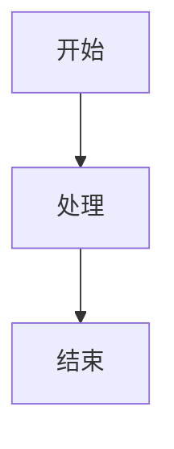

# 合并导出格式规则

本规则文档用于指导 merge-agent 执行阶段八的合并导出工作，必须严格遵循。

## 一、合并规则

### 1.1 合并顺序

- 按 `outline.json` **深度优先遍历**顺序合并
- `write_content: false` 节点输出标题后递归子节点
- `write_content: true` 节点读取对应 .md 文件完整内容
- 节点间用空行分隔

### 1.2 深度优先遍历算法

1. 从根节点（level=1）开始
2. 对每个节点，先输出该节点的标题行（`#` 数量对应 level）
3. 若 `write_content: true`：读取对应 .md 文件内容并追加
4. 若 `write_content: false`：递归处理其 `children` 数组
5. 节点间用空行分隔

### 1.3 标题层级映射

| Markdown 标题 | Word 样式 | 字体 | 字号 | 对齐 |
|---------------|-----------|------|------|------|
| `#` | 标题1 | 黑体 | 二号 | 居中 |
| `##` | 标题2 | 黑体 | 三号 | 左对齐 |
| `###` | 标题3 | 黑体 | 小三号 | 左对齐 |
| `####` | 标题4 | 黑体 | 四号 | 左对齐 |
| `#####` | 标题5 | 黑体 | 小四号 | 左对齐 |
| `######` | 标题6 | 黑体 | 小四号 | 左对齐 |

### 1.4 合并格式示例

```markdown
# 技术方案

## 项目需求分析及理解

### 项目背景分析

（正文内容...）

### 服务思路设计

（正文内容...）


*图 1-1-4-1 服务整体架构图*

（更多正文内容...）
```

## 二、图表处理规则

### 2.1 图表渲染三级降级方案

| 降级层级 | 策略 | 适用场景 | 实现位置 |
|----------|------|----------|----------|
| **第一层** | 保留 Mermaid 代码块，在 merge_report.md 中记录异常 | Mermaid 语法错误、渲染环境问题 | render_mermaid.py |
| **第二层** | 生成占位图（显示图表标题和描述），替换原代码块 | 渲染超时、内存不足等临时问题 | render_mermaid.py |
| **第三层** | 将图表转换为文字描述，插入正文对应位置 | 渲染服务不可用、严重环境问题 | render_mermaid.py |

**重试机制**：渲染失败后等待 30 秒重试，最多重试 2 次。重试全部失败后进入降级流程。

### 2.2 图片命名规则

- 渲染成功：`<chart_id>.png`（如 `1_1_4_c1.png`）
- 占位图：`<chart_id>_placeholder.png`（如 `1_1_4_c1_placeholder.png`）
- 存储路径：`final_document_file/images/`

### 2.3 图题编号生成规则

- 格式：`图 <层级1>-<层级2>-<层级N>-<图表序号>`
- 示例：`图 1-1-4-1 服务整体架构图`
- 编号来源：node_id 路径（`1_1_4` → `1-1-4`）+ 节点内图表序号

**编号生成算法**：
1. 遍历 outline.json，收集所有 `generate_chart: true` 的节点
2. 根据节点 `node_id` 提取层级路径（`1_1_4` → `1-1-4`）
3. 在该节点的 `charts` 数组中，按顺序为每个图表添加序号
4. 组合为完整编号：`<层级路径>-<图表序号>`

### 2.4 图题格式规范

- **Markdown 文本格式**：`*图 X-Y-Z-N 标题*`（斜体）
- **位置**：图片下方，空一行
- **Word 格式**：宋体、五号、居中

**正确示例**：
```markdown


*图 1-1-4-1 服务整体架构图*
```

### 2.5 图片格式规范

- 宽度：页面宽度的 80%（默认 15cm）
- 对齐：居中
- 图片与图题之间空一行

### 2.6 Mermaid 代码块格式（输入）

````markdown


*图 1-1-4-1 服务整体架构图*
````

## 三、表格处理规则

### 3.1 表格编号

- 格式：`表 <层级1>-<层级2>-<层级N>-<表格序号>`
- 示例：`表 1-1-3-1 项目需求分析表`
- 编号逻辑：同图题编号规则（基于 node_id 路径映射）
- 位置：表格上方，居中显示

### 3.2 表格样式

- 表头行：加粗、居中、浅灰底纹（#D9D9D9）
- 表格内容：宋体、五号
- 表格宽度：自适应页面宽度
- 对齐：居中
- 边框：单线、细线

### 3.3 表格示例

```markdown
*表 1-1-3-1 项目需求分析表*

| 需求项 | 具体要求 | 优先级 |
|--------|----------|--------|
| 系统稳定性 | 7×24 小时不间断运行 | 高 |
| 响应时间 | 平均响应时间 ≤ 2 秒 | 中 |
```

## 四、Word 自动编号规则

### 4.1 标题编号方案

| 样式 | 编号格式 | 示例 |
|------|----------|------|
| 标题1 | 无编号（文档标题） | 技术方案 |
| 标题2 | `第X章` | 第2章 项目需求分析及理解 |
| 标题3 | `X.X` | 2.1 项目背景分析 |
| 标题4 | `X.X.X` | 2.1.1 政策背景 |
| 标题5 | `X.X.X.X` | 2.1.1.1 国家政策 |
| 标题6 | `X.X.X.X.X` | 2.1.1.1.1 具体条款 |

### 4.2 编号连续性规则

- 各层级计数器独立维护
- 遇到下级标题时重置更下级计数器
- Markdown 中**不包含硬编码编号**，由 `md_to_docx.py` 自动添加
- 编号样式由 Word 多级列表样式驱动

### 4.3 编号生成示例

输入 Markdown：
```markdown
# 技术方案

## 项目需求分析及理解

### 项目背景分析

#### 政策背景
```

输出 Word（自动编号后）：
```
技术方案                          ← 标题1，无编号

第1章 项目需求分析及理解            ← 标题2，第X章

1.1 项目背景分析                  ← 标题3，X.X

1.1.1 政策背景                    ← 标题4，X.X.X
```

## 五、段落格式规则

### 5.1 正文段落

- 字体：宋体
- 字号：小四号
- 行距：1.5 倍行距
- 缩进：首行缩进 2 字符
- 对齐：两端对齐
- 段前段后：0 行

### 5.2 标题段落

- 段前段后：各 0.5 行
- 不缩进
- 行距：单倍行距

### 5.3 图题/表题段落

- 字体：宋体
- 字号：五号
- 对齐：居中
- 段前段后：各 0.5 行

## 六、代码块格式

- 字体：Consolas / Courier New
- 字号：五号
- 背景：浅灰色底纹（#F5F5F5）
- 边框：单线、细线、深灰（#CCCCCC）
- 缩进：无

## 七、列表格式

| Markdown 格式 | Word 格式 | 说明 |
|---------------|-----------|------|
| `- ` / `* ` | 项目符号列表 | 使用圆点符号 |
| `1. ` / `2. ` | 编号列表 | 自动连续编号 |
| `- [ ] ` | 待办列表 | 转换为项目符号列表 |

## 八、行内格式

| Markdown | Word | 说明 |
|----------|------|------|
| `**加粗**` | 加粗 | 强调关键词 |
| `*斜体*` | 斜体 | 用于图题/表题 |
| `~~删除线~~` | 删除线 | 一般不使用 |
| `` `代码` `` | 等宽字体 | 行内代码 |

## 八.5、字数统计口径

### 8.5.1 统计规则

| 统计项 | 是否计入字数 |
|--------|-------------|
| 正文段落文字 | 是 |
| 标题文字（# 开头） | 否 |
| 图表代码块（\`\`\`mermaid ... \`\`\`） | 否 |
| 图题文字（如 `*图 X-Y-Z-N 标题*`） | 否 |
| 表题文字（如 `*表 X-Y-Z-N 标题*`） | 否 |
| 图片引用行（``） | 否 |
| 表格内容 | 是 |
| 表格分隔行（仅含 |、-、: 字符） | 否 |
| 列表内容 | 是 |
| 引用内容 | 是 |
| 行内代码（\`code\`） | 是（按字面字符计） |
| 代码围栏行（\`\`\`） | 否 |
| 空行 | 否 |
| HTML 注释行 | 否 |

### 8.5.2 实现位置

- SKILL.py 的 `_count_words()` 方法提供统一实现
- `merge_proposal()` 函数调用 `_count_words()` 统计各章节字数
- 报告生成时从 merge_stats.json 读取，保证口径一致

## 九、文件命名规则

### 9.1 中间文件

- `merged_proposal.md`：合并后的完整 Markdown 文档
- `_temp_merged.md`：合并过程中的临时文件（最终删除）
- `_chart_mapping.json`：图表映射临时 JSON 文件（最终删除）

### 9.2 最终文档

- 格式：`<当前日期(yyyy-MM-dd)>_<项目名称>_技术方案.docx`
- 示例：`2026-08-02_竹山县地膜项目_技术方案.docx`
- 特殊字符处理：项目名称中的 `/ \ : * ? " < > |` 需替换为下划线

### 9.3 文件存储路径

```
final_document_file/
├── images/                  # 渲染后的 PNG 图片
│   ├── 1_1_4_c1.png
│   └── 1_1_4_c2_placeholder.png
├── merged_proposal.md       # 合并后的完整 Markdown
├── merge_report.md          # 合并导出报告
└── <日期>_<项目名称>_技术方案.docx  # 最终 Word 文档
```

## 十、合并导出报告规范

### 10.1 报告内容

`merge_report.md` 应包含以下内容：

1. **概述**
   - 项目名称、导出时间、导出状态
   - 总章节数、总字数

2. **章节统计**
   - 各章节字数统计
   - 章节合并情况

3. **图表渲染统计**
   - 图表总数、成功数、降级数、失败数
   - 各图表的渲染结果详情
   - 降级/失败原因

4. **异常记录**
   - 文件缺失/读取异常
   - 图表渲染异常
   - 脚本执行异常

5. **输出文件信息**
   - merged_proposal.md 路径和大小
   - Word 文档路径和大小
   - images 目录文件数和总大小

### 10.2 存储路径

- `final_document_file/merge_report.md`

### 10.3 报告格式示例

```markdown
# 合并导出报告

## 概述
- 项目名称：竹山县地膜项目
- 导出时间：2026-08-02 14:30:00
- 导出状态：成功
- 总章节数：25
- 总字数：35,000 字

## 章节统计
| 节点ID | 标题 | 字数 | 图表数 |
|--------|------|------|--------|
| 1_1_1 | 项目背景分析 | 3,200 | 0 |
| 1_1_4 | 服务思路设计 | 2,800 | 2 |
| ... | ... | ... | ... |

## 图表渲染统计
- 图表总数：12
- 渲染成功：10
- 降级处理：2
- 完全失败：0

| chart_id | 标题 | 类型 | 图题编号 | 渲染结果 | 降级层级 |
|----------|------|------|----------|----------|----------|
| 1_1_4_c1 | 服务整体架构图 | flowchart | 1-1-4-1 | 成功 | - |
| 1_1_4_c2 | 数据流程图 | flowchart | 1-1-4-2 | 降级 | 2 |

## 异常记录
| 时间 | 类型 | 描述 | 处理方式 |
|------|------|------|----------|
| 14:25:30 | 图表渲染失败 | chart_id: 1_1_4_c2, 原因: Mermaid 语法错误 | 占位图替换 |

## 输出文件
| 文件 | 路径 | 大小 |
|------|------|------|
| Markdown 文档 | final_document_file/merged_proposal.md | 256 KB |
| Word 文档 | final_document_file/2026-08-02_竹山县地膜项目_技术方案.docx | 1.2 MB |
| 图片目录 | final_document_file/images/ | 12 个文件，总大小 480 KB |
```

## 十一、异常处理规则

### 11.1 异常处理原则

- **不阻断流程**：单个图表渲染失败不阻断整体导出
- **完整记录**：所有异常必须记录到 merge_report.md
- **降级处理**：优先采用降级方案保证导出完成
- **失败返回**：关键步骤（如 md_to_docx.py 执行）失败需返回失败状态

### 11.2 异常处理矩阵

| 异常类型 | 处理机制 | 回退策略 |
|----------|----------|----------|
| 正文 .md 文件缺失 | 记录缺失文件，插入占位文字 | 继续合并其他节点 |
| Mermaid 代码块与图表定义不匹配 | 按 charts 数组顺序匹配 | 按顺序匹配或保留代码块 |
| render_mermaid.py 执行失败 | 记录错误，保留原 Mermaid 代码块 | 第一层降级 |
| render_mermaid.py 超时 | 等待 5 分钟后终止，保留原代码块 | 第一层降级 |
| md_to_docx.py 执行失败 | 记录错误，返回失败结果 | 主控 Agent 提示用户检查依赖 |
| 图片文件缺失 | md_to_docx.py 插入"[图片缺失]"文字 | 继续转换 |
| 目录权限不足 | 记录错误，返回失败结果 | 主控 Agent 提示用户检查权限 |
| 磁盘空间不足 | 记录错误，返回失败结果 | 主控 Agent 提示用户检查空间 |

## 十二、质量检查清单

### 12.1 合并前检查

- [ ] metadata.json 中 `proposal_files_locked` 为 `true`
- [ ] outline.json 存在且结构完整
- [ ] 所有 `write_content: true` 节点的 .md 文件存在
- [ ] `final_document_file/` 和 `images/` 目录可创建

### 12.2 合并后检查

- [ ] merged_proposal.md 已生成且内容完整
- [ ] 所有 Mermaid 代码块已处理（渲染或降级）
- [ ] 图题编号格式正确（图 X-Y-Z-N）
- [ ] 章节顺序符合 outline.json 深度优先遍历
- [ ] 节点间空行分隔正确

### 12.3 导出后检查

- [ ] Word 文档已生成且可打开
- [ ] Word 标题自动编号正确（第X章、X.X、X.X.X）
- [ ] 图片已插入到 Word 文档（非缺失）
- [ ] 表格格式正确（表头加粗灰底）
- [ ] 正文段落格式正确（宋体小四1.5倍行距）
