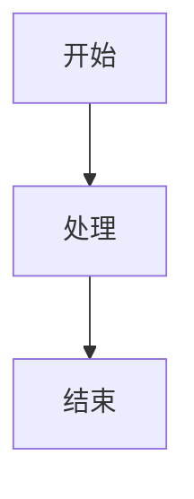

# 正文撰写规则

本规则文档用于指导 writer-agent 撰写技术方案正文，必须严格遵循。

## 一、标题格式规则

### 1.1 标题编号规则
- 所有标题**不添加数字编号**，编号由 Word 样式自动生成
- 禁止使用「第X章」「X.X」「X.X.X」等硬编码编号
- 禁止在标题前添加「1.」「2.」等序号

**正确示例**：
```markdown
#### 应急响应流程
```

**错误示例**：
```markdown
#### 1. 应急响应流程
#### 第1章 应急响应流程
#### 1.1 应急响应流程
```

### 1.2 标题层级规则
- 标题层级不得超过大纲节点层级一级（参考附件7）
- 标题层级必须连续，禁止跳级
- 层级上限为6级（`######`）

**层级限制说明**：

| 大纲节点层级 | 允许的正文标题层级 | 禁止的正文标题层级 |
|------------|------------------|------------------|
| `##`（层级2） | `###`（层级3） | `####` 及以下 |
| `###`（层级3） | `####`（层级4） | `#####` 及以下 |
| `####`（层级4） | `#####`（层级5） | `######` 及以下 |
| `#####`（层级5） | `######`（层级6） | 无（已达上限） |

**说明**：层级6（`######`）仅用于正文撰写阶段，不在 outline.json 中定义。AI 撰写时仅允许在当前大纲叶子节点层级基础上向下扩展一级，不得超过层级6。

**正确示例**（大纲定义 `### 应急预案` 层级3）：
```markdown
### 应急预案

#### 应急响应流程

#### 应急处置措施

#### 应急资源配置
```

**错误示例**（大纲定义 `### 应急预案` 层级3，但正文写到了层级5）：
```markdown
### 应急预案

#### 应急响应流程

##### 响应级别划分    ← 错误：超出大纲节点层级一级

###### 一级响应标准    ← 错误：超出大纲节点层级一级
```

### 1.3 标题格式要求
- 标题后**不添加标点符号**（如句号、冒号、问号等）
- 标题内容简洁明确，准确反映章节主题
- 同级标题格式保持一致

**正确示例**：
```markdown
#### 应急响应流程
```

**错误示例**：
```markdown
#### 应急响应流程。
#### 应急响应流程：
#### 应急响应流程？
```

## 二、正文排版规则

### 2.1 段落格式
- 段落之间**空一行分隔**
- 段落内容逻辑清晰，论证充分

**示例**：
```markdown
本项目是面向交通运输行业的运维服务项目，旨在通过信息化手段提升运维效率和服务质量。项目涵盖了设备监控、故障诊断、应急响应等多个方面。

为确保项目顺利实施，本项目制定了完善的服务方案。服务方案从需求分析、方案设计、实施部署、运维保障四个维度展开论述，确保技术方案完整响应招标文件要求。
```

### 2.2 标点符号规则
- 正文使用**中文标点符号**（，。！？；：""''）
- 英文单词、数字、代码中使用英文标点
- 中文内容使用全角标点，英文内容使用半角标点

**正确示例**：
```markdown
　　本项目采用 BIM（建筑信息模型）技术，实现运维管理的数字化、可视化。
```

### 2.3 术语规范
- 术语首次出现时注明定义或全称
- 后续使用保持术语一致性，不随意更换同义词
- 项目相关专有名词保持统一

**示例**：
```markdown
**建筑信息模型（Building Information Modeling，BIM）**：是一种数字化代表设施物理和功能特性的信息模型，通过对设施全生命周期数据的集成与管理，实现设施的可视化、协同化和精细化管理。

后续使用：BIM 技术在本项目中发挥重要作用。
```

## 三、图表规范规则

### 3.1 Mermaid 代码块格式
- 代码块前添加图表类型注释：`<!-- chart_type: flowchart -->`
- 代码块使用 ```mermaid 标记
- 代码块后添加图题引用标记：`*图 <层级编号>-<图表序号> <图题名称>*`

**完整格式示例**：
````markdown
<!-- chart_type: flowchart -->


*图 1-1-4-1 服务整体架构图*
````

### 3.2 图表类型选择

| 图表类型 | 适用场景 |
|----------|----------|
| flowchart | 业务流程、系统架构、组织架构、应急处置逻辑等 |
| sequenceDiagram | 系统模块间调用交互、服务协同流程 |
| gantt | 项目进度计划、工期安排 |
| pie | 项目成本占比、资源投入分布 |
| erDiagram | 数据库结构、数据模型映射关系 |

### 3.3 图表放置规则
- 图表就近放置，位于首次提及该图表的段落附近
- 图表不跨章节边界
- 图表应完整显示，不得拆分

### 3.4 图题格式规则
- 图题位于图表下方
- 格式：`*图 <层级编号>-<图表序号> <图题名称>*`
- 层级编号根据 node_id 的路径结构提取（如 `1_1_3` → `1-1-3`）
- 图表序号为该节点内图表的顺序（1, 2, 3...）

**示例**：
- 节点 `1_1_4` 的第 1 个图表：`*图 1-1-4-1 服务整体架构图*`
- 节点 `1_2_2_1` 的第 2 个图表：`*图 1-2-2-1-2 技术支持响应流程图*`

### 3.5 图表说明文本

在正文中引用图表时，使用以下格式：

```markdown
**图 <层级编号>-<图表序号> <图题名称>**：<简要说明>
```

示例：
```markdown
**图 1-1-4-1 服务整体架构图**：本图展示了服务的整体架构设计，包含服务层、支撑层和应用层。
```

**图题与图表说明的区别**：

| 类型 | 格式 | 位置 | 用途 |
|------|------|------|------|
| 图题 | 斜体 `*图 X-Y-Z-N 图题名称*` | 图片正下方 | 标识图表编号和名称 |
| 图表说明 | 粗体 `**图 X-Y-Z-N 图题名称**：说明` | 正文中首次提及图表处 | 在正文段落中引用图表并进行文字说明 |

## 四、表格规范规则

### 4.1 表格格式
- 表格标题位于表格上方
- 格式：`**表 <层级编号>-<表格序号> <表格名称>**`
- 表头行加粗、居中

**示例**：
```markdown
**表 1-1-3-1 项目需求分析表**

| 需求类别 | 需求描述 | 优先级 |
|----------|----------|--------|
| 功能需求 | 用户登录功能 | 高 |
| 性能需求 | 响应时间<2秒 | 高 |
```

### 4.2 复杂表格处理
- 对于合并单元格等复杂表格，使用 HTML 表格语法
- 保持表格内容对齐整齐

## 五、字数控制规则

### 5.1 统计口径

| 统计项 | 是否计入字数 |
|--------|-------------|
| 正文段落文字 | 是 |
| 标题文字 | 否 |
| 图表代码块 | 否 |
| 图题文字 | 否 |
| 表格内容 | 是 |
| 列表内容 | 是 |
| 引用内容 | 是 |

### 5.2 偏差允许范围（只下限不限上限）

**策略说明**：为鼓励内容充分论述，避免为凑字数而削减有效内容，字数控制采用"只下限不限上限"策略。

| 偏差范围 | 状态标识 | 判定结果 | 处理方式 |
|---------|---------|---------|---------|
| 偏差 < -15%（字数不足下限） | `insufficient` | ❌ 不合格 | 需补充内容，触发内容补充机制 |
| -15% ≤ 偏差 ≤ +15% | `qualified` | ✅ 合格 | 无需调整 |
| 偏差 > +15%（字数超标） | `over_count` | ✅ 合格（仅记录） | 不限制，仅作记录，不要求精简 |

**判定示例**（计划字数 1000）：
- 实际 800 字（偏差 -20%）→ `insufficient`，需补充
- 实际 950 字（偏差 -5%）→ `qualified`，合格
- 实际 1100 字（偏差 +10%）→ `qualified`，合格
- 实际 1500 字（偏差 +50%）→ `over_count`，合格（仅记录）

### 5.3 字数调整策略
- 字数不足（`insufficient`）：必须补充内容细节、增加论证深度、增加案例分析
- 字数超标（`over_count`）：不强制调整，仅作记录（如严重超标可由主控 Agent 酌情精简）

## 六、内容完整性规则

### 6.1 content_plan 覆盖要求
- 正文必须覆盖 content_plan 中的**所有要点**
- 要点覆盖率 ≥ 80% 为合格

### 6.2 评分标准响应要求
- 正文内容必须充分响应 07_Evaluation_Criteria.md 中的评分要点
- 每个评分要点必须有对应的论述内容
- 论述应具体、深入，避免空泛表述

### 6.3 逻辑结构要求
- 内容层次分明，逻辑清晰
- 段落之间衔接自然
- 避免内容重复（重复率 ≤ 20%）

## 七、代码块规范规则

### 7.1 代码块格式
- 指定代码语言标识（如 python、json、bash）
- 代码块前后各空一行
- 保持原代码缩进

**示例**：
````markdown
```python
def hello():
    print("Hello, World!")
```
````

### 7.2 行内代码格式
- 使用 `code` 格式
- 用于代码、变量名、文件名等

**示例**：
```markdown
使用 `python-docx` 库处理 Word 文档。
```

## 八、引用格式规则

### 8.1 引用语法
- 使用 `> 引用文本` 格式
- 引用前后各空一行
- 引用内容字号小于正文

**示例**：
```markdown
> 本条规定了运维服务的基本要求，投标人应严格遵循。
```

### 8.2 多级引用

```markdown
> 一级引用
>> 二级引用
>>> 三级引用
```

## 九、列表格式规则

### 9.1 无序列表
- 使用 `-`（减号）作为符号
- 子列表缩进4个空格
- 列表前后各空一行

**示例**：
```markdown
- 列表项1
- 列表项2
    - 子列表项1
    - 子列表项2
```

### 9.2 有序列表
- 使用数字 + `.` 作为符号
- 子列表缩进4个空格
- 列表前后各空一行

**示例**：
```markdown
1. 列表项1
2. 列表项2
    1. 子列表项1
    2. 子列表项2
```

## 十、质量自查清单

### 10.1 格式检查
- [ ] 标题仅使用 Markdown 层级符号，不添加数字编号
- [ ] 标题层级连续，不跳级
- [ ] 标题层级不超过大纲节点层级一级
- [ ] 段落之间空一行分隔
- [ ] 图表代码块后添加图题引用标记
- [ ] 表格上方添加表格标题
- [ ] 使用中文标点符号

### 10.2 内容检查
- [ ] 正文覆盖 content_plan 中的所有要点
- [ ] 术语使用前后一致
- [ ] 充分响应评分标准要求
- [ ] 逻辑清晰，层次分明
- [ ] 内容重复率 ≤ 20%

### 10.3 质量检查
- [ ] 字数符合要求（字数不足下限 -15% 为不合格，超标不限制）
- [ ] Mermaid 代码语法正确
- [ ] 图表内容与正文呼应
- [ ] 语言通顺，无语法错误

### 10.4 去AI味检查（参考 .trae/rules/anti_ai_writing_rules.md）
- [ ] 未使用"综上所述"、"总而言之"、"与此同时"等禁用过渡词
- [ ] 未使用"赋能"、"底层逻辑"、"闭环"等空洞套话
- [ ] 段落中长短句交错，没有连续相同长度的句子
- [ ] 主动语态优先，没有过度使用被动语态
- [ ] 没有机械套用"背景-现状-问题-对策"模板
- [ ] 结尾没有强行升华，自然收尾
- [ ] 每个核心观点都有具体数据或案例支撑


